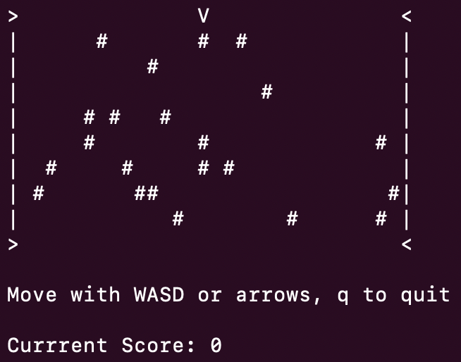

# Road Crosser

## Description
Terminal game designed to run on Mac.

A small project to apply C++ learnings, based on the popular mobile game, *Crossy Road*.

Learned about Makefile usage and the Raylib library in a 2D scenario.
## Quickstart Guide
1. Install ncurses, if you have not already, using: `brew install mac`.
2. Build the executables with: `make`.
3. Run the game with: `./run`.
4. Optionally, remove objects with `make clean`.

### Controls
- WASD or arrow key movement control.
- Q to quit at any time.

### Gameplay
- Avoid cars, denoted `#`.
- Reach the bottom row to score a point.
- The game ends if a car is hit.
- Final score display at the end.

